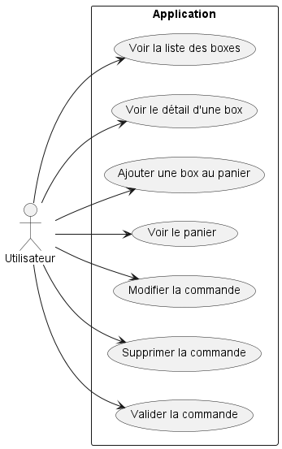
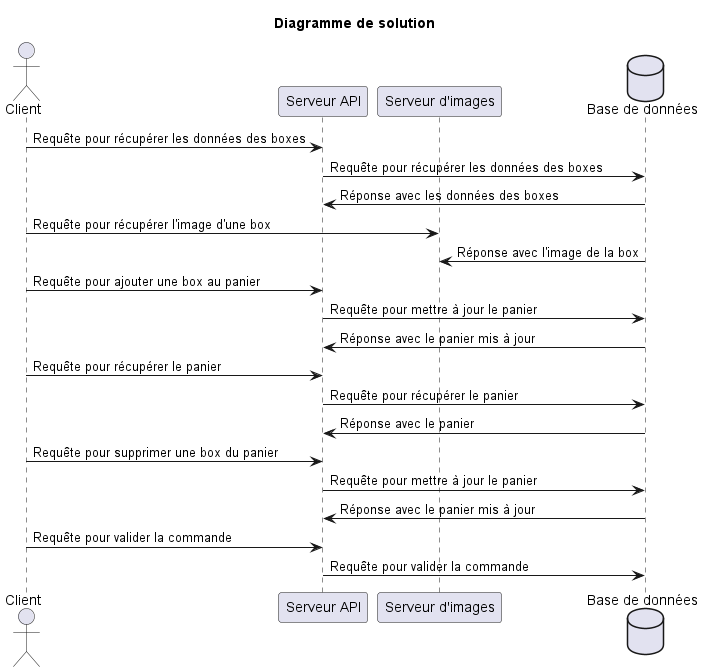
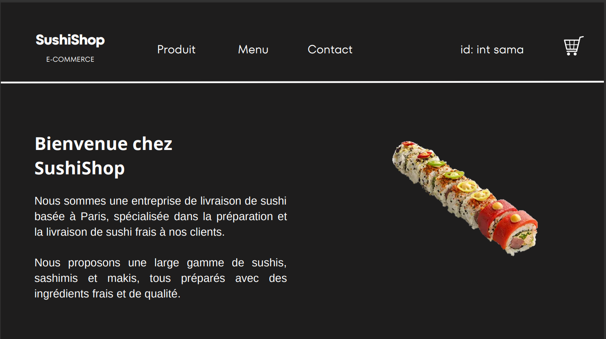
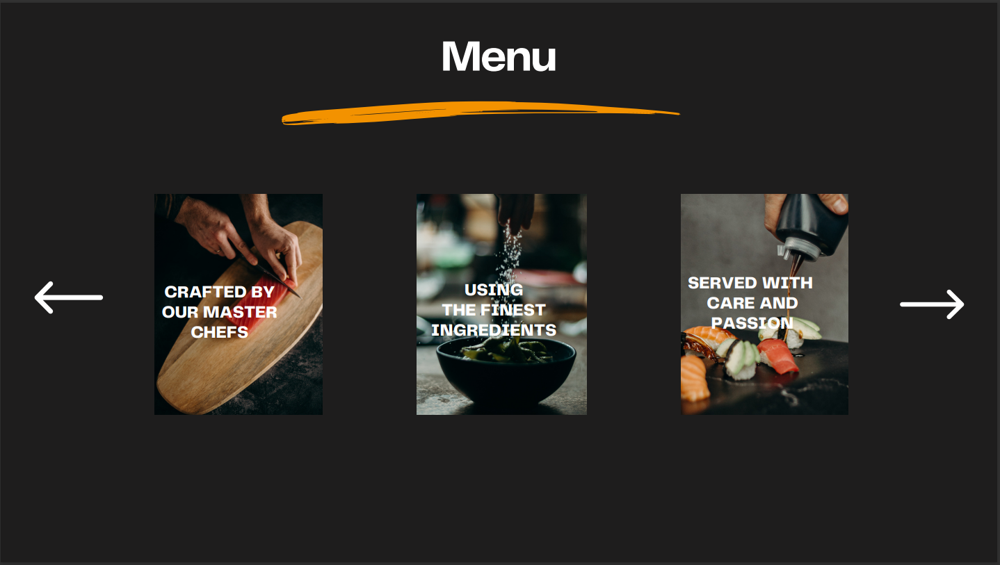
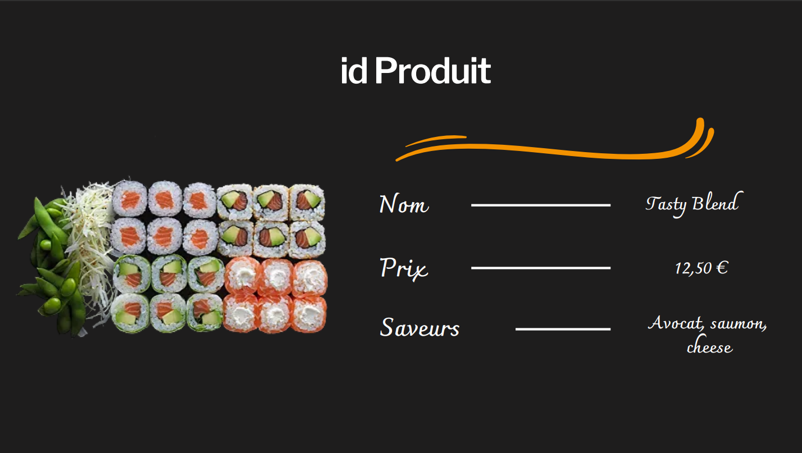
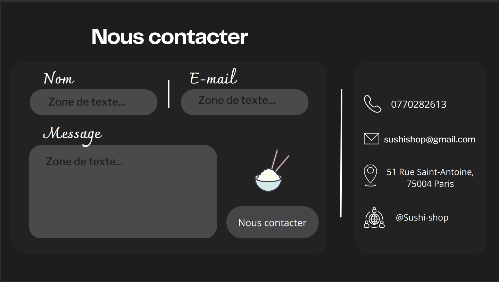
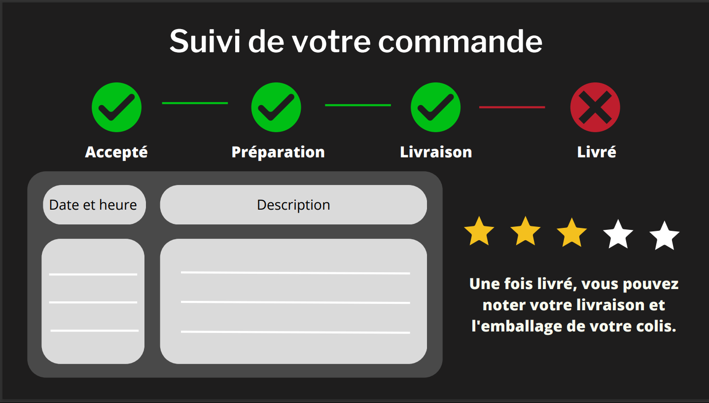

= Compte Rendu Sushi Shop
:author: Tabar Labonne Baptiste,Laroui Chakib, Rodrigues Loïc et Caffiaux Elian
:docdate: 2023-03-20
:asciidoctor-version:1.1
:description: Projet SushiShop
:icons: font
:ting-caption: Listing
:toc-title: Table des matières
:toc: left
:toclevels: 4

//:source-highlighter: coderaynt

== Le Diagramme des cas utilisations

== Le Diagramme présentant les différents tiers

== La Maquette

Nous avons 5 pages

-Une page accueil(Produit,Menu,Contact,Achat)

-La page menu avec un menu déroulant qui affiche tous les produits à sélectionner

-Une page produit avec le détail du produit(Nom,Prix,Aliments)
[]

-Une page contact avec l'adresse le numéro de telephone

-Cette page nous permet ensuite de suivre la commande.

== La structure (JSON) du panier sauvegardé sur le client

====
[source,json]
----
{
  "items": [
    {
      "id": 1,
      "name": "SushiBox1",
      "image": "https://test.jpg",
      "price": 10,
      "pieces": 6,
      "quantity": 2
    },
    {
      "id": 2,
      "name": "SushiBox2",
      "image": "https://test2.jpg",
      "price": 15,
      "pieces": 8,
      "quantity": 1
    }
  ],
  "total": 35
}
----
====
